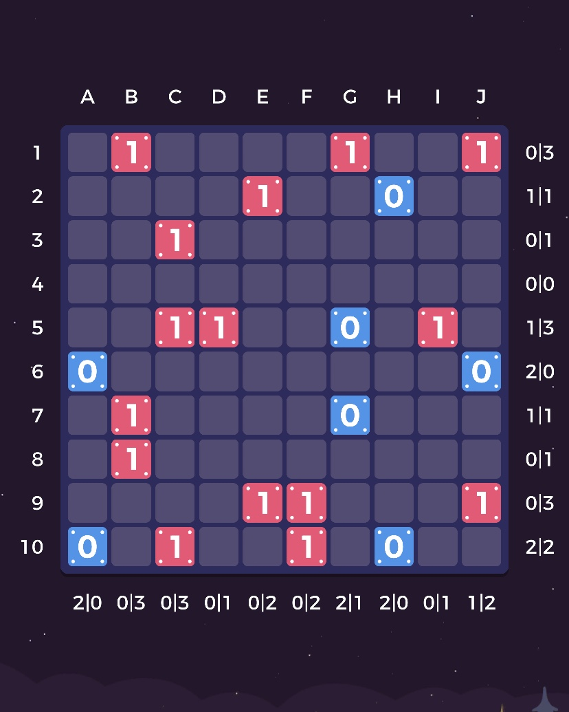

## A Life of Logic 解题/解题辅助程序

[English Version of README](README-EN.md)

### 游戏简介

A Life of Logic 是一个类似数独的根据一定规则填数的益智游戏，在各区 [App Store](https://apps.apple.com/cn/app/a-life-of-logic/id1329455663) 提供下载。规则十分简单，玩家需要补全所有空格，过程中需要满足以下三个规则：

* 不能有连续的三个相同数字
* 每行每列 0、1 的个数必须相同
* 不能有完全一样的行或者列





在玩到天文学家章节 - 里程碑 14 的某一道题被彻底折磨的作者选择写一个 Python 来辅助推断，并在后续演变成了可以直接解出部分题的代码。

这条代码效率并不优秀，使用了非常多的重复语句只为枚举每行、每列。不过鉴于运算量不大运行时间通常也不会超过 1s，代码实用主义而并未进行进一步的算法优化。

### 使用说明

将位于头部的 `block` 变量修改为你需要解的题目，用「X」代替空格（未知量），类似代码中已经给出的例子，以段落的形式列举全部地图，然后直接运行即可。

```python
block = '''X1XXXX1XX1
XXXX1XX0XX
XX1XXXXXXX
XXXXXXXXXX
XX11XX0X1X
0XXXXXXXX0
X1XXXX0XXX
X1XXXXXXXX
XXXX11XXX1
0X1XX1X0XX''' #一个 10*10 地图的例子
```

### 原理简介

#### 第一步: 规则填空

程序首先满足三个规则的前两个，来填补部分数字（函数 `huajian()`），将会执行以下运算：

* 如果一个 X 被两个相同的数字夹在中间，则 X 填写为相反数（函数 `jia()`）
* 如果一个 X 靠着两个相邻的相同的数字，则 X 填写为相反数（函数 `lin()`）
* 如果该行该列已经只剩下 1 或者 0 可以填，则把该行该列填满（函数 `hlc()`）
* 如果该行该列还差 3 个未填，且空格的边缘有已知数字，并且如果不按某种填法填的话势必造成三个相同数字相邻违反规则一，则会按照不会违反规则的填法填写然后留下 2 个空未填（分别可能是 0、1 或者 1、0）（函数 `bu()`）

反复执行上次操作，直到操作不会改变结果或者已经填满地图（适用于较为简单的题目）则跳出循环。

#### 第二步: 枚举不可能值

以上操作不能解决天文学家章节之后的绝大多数题目，因此还需要进一步处理，当然，你也可以选择在第 180 余行的 while True 前加入 input() 或其他终止程序语句，则该代码可以帮你补全一些比较明显的空，而不会进行暴力枚举。

进入枚举阶段后，会把每一个未知空填数字 0 和 1，并进行一次查错运算（函数 `chacuo()`），查错会分析填完 0 或者 1 之后会不会造成违规，例如：

* 出现了三个相邻的相同数字（四个 if 实现）
* 在按照规则填满行、列的时候，出现了 0、1 数量不等（两个 if 实现）
* 在按照规则填满行、列的时候，出现了某行某列完全相同（for 循环和两个 if 实现）

出现以上情况，chacuo 函数会 return 1，这将使枚举循环回滚猜测，输出 Impossible。由于不能填 0 只能填 1，于是会填写造成 Impossible 的相反数，如此往复，直到函数不能改变结果，退出循环。

#### 第三步:

没有第三步了，以上两步已经可以解决里程碑 17 之前的很多题目，如果仍然不能解出答案，这是因为每次枚举只会枚举一个空为 0 或者 1，其他空保持未知，并不会多空同时枚举，此时玩家可以手动进行猜测，然后继续用程序辅助化简，最终得出答案。

一种比较快的手动猜测方法是，找到还差两个 0 或者 1 没填的行、列，根据排列组合的知识，假设总共还有 n 个空没填，则只有 `C(n, 2)`，即 `n*(n-1)/2` 种可能（GitHub 为什么不支持 Markdown 内联公式…）一般来说最多也就 10 种，如果是 12*12 的有可能有 15 种，做一些尝试即可。经验证，通过这样的方法，可以解出所有这个游戏里面的所有题目。


欢迎修正拙劣的算法或做其他各类修改。